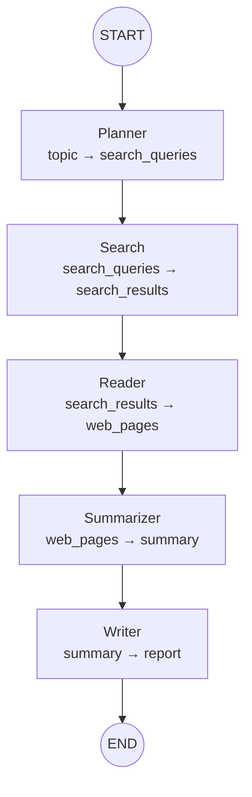

# Architecture

## Overview

Research Agent is a **LangGraph**-powered AI research assistant. Input a topic — get a structured Markdown report. It automates the full pipeline: search, read, analyze, and write.

The architecture follows a **layered, decoupled** design:

```
┌──────────────────────────────────────────┐
│              Command Line                 │
│         (__main__.py / scripts/)          │
├──────────────────────────────────────────┤
│              Workflow Layer               │
│          (graph/ + state/)                │
├──────────────────────────────────────────┤
│   Nodes         │   Prompts               │
│   (nodes/)      │   (prompts/)            │
├──────────────────────────────────────────┤
│   Tools Layer                             │
│   (tools/ - search / web_reader)          │
├──────────────────────────────────────────┤
│   LLM Layer                               │
│   (llm/ - 抽象基类 + OpenAI Compatible)   │
└──────────────────────────────────────────┘
```

## Module responsibilities

### LLM layer (`llm/`)

**Responsibility**: Provide a unified LLM interface that abstracts over different model providers.

**Key design decisions**:

- **抽象基类** `BaseLLMClient` 定义 `invoke` / `ainvoke` 契约
- **工厂函数** `get_llm()` 根据配置返回对应实现，调用方不感知具体类
- **错误映射**：将 OpenAI SDK 的 `APIStatusError` 等异常映射为业务异常（`LLMAuthenticationError`、`LLMRateLimitError` 等）
- **当前实现**：`OpenAICompatibleClient`，兼容所有 OpenAI Chat Completions 接口的模型（通义千问、GPT、DeepSeek 等）

**扩展方式**：

```python
class GPTClient(BaseLLMClient):
    def invoke(self, message: str, **kwargs) -> LLMResponse: ...
    async def ainvoke(self, message: str, **kwargs) -> LLMResponse: ...

register_provider("gpt", GPTClient)
```

### Tool layer (`tools/`)

**Responsibility**: Provide search and web reading as standalone, swappable capabilities.

**关键设计**：

- **搜索**：`BaseSearchClient` 抽象基类 + Registry 模式。当前使用 `ddgs` 库（DuckDuckGo），通过 `register_search_engine()` 注册新引擎
- **网页读取**：`BaseWebReader` 抽象基类。`HtmlWebReader` 基于 httpx + BeautifulSoup，自动降级（403 → 备用 UA + verify=False）
- **数据模型**：`SearchResult` 和 `WebPage` dataclass，作为层间数据契约

**扩展方式**：

```python
register_search_engine("tavily", TavilySearchClient)
register_web_reader("jina", JinaWebReader)
```

### Prompt layer (`prompts/`)

**Responsibility**: Centralize all LLM prompts, keeping them separate from code.

**关键设计**：

- Prompt 以 `.txt` 文件存储，修改 Prompt 不需要改 Python 代码
- `load_prompt(name, **kwargs)` 基于 Python `str.format()` 做模板渲染
- 变量用 `{topic}`、`{pages_text}` 等占位符

### Node layer (`nodes/`)

**Responsibility**: Implement the logic for each workflow step.

**Design principles**:

- **Single responsibility**: Each node does exactly one thing (planner generates queries, search searches, reader fetches...)
- **Functional style**: Receives `ResearchState`, returns a `dict` delta — no side effects
- **Error isolation**: A single node failure doesn't break the entire graph

### Workflow layer (`graph/` + `state/`)

**Responsibility**: Orchestrate node execution order and maintain global state via LangGraph.

**Key design decisions**:

- `StateGraph(ResearchState)` compiles into a callable object
- Nodes communicate **only through State** — no direct function calls
- `ResearchState` uses `TypedDict` with fields ordered by data flow direction

## Workflow



## Data flow

```
topic (str)
  ↓ Planner (LLM)
search_queries (list[str])
  ↓ Search (DuckDuckGo)
search_results (list[SearchResult])
  ↓ Reader (httpx + BeautifulSoup)
web_pages (list[WebPage])
  ↓ Summarizer (LLM)
summary (str)
  ↓ Writer (LLM)
report (str)
```

## Extensibility guide

### Add a new search provider

1. Inherit `BaseSearchClient` in `tools/search.py`
2. Call `register_search_engine("engine_name", YourClient)`
3. Use `get_search_client("engine_name")` anywhere

### Add a new workflow node

1. Add a field to `ResearchState` in `state/__init__.py`
2. Create a node function in `nodes/`
3. `add_node()` + `add_edge()` in `graph/__init__.py`

### Switch LLM model

Edit `.env`:
```env
LLM_BASE_URL=https://api.openai.com/v1
LLM_MODEL=gpt-4o-mini
DASHSCOPE_API_KEY=sk-xxxxx
```

## Tech stack

| Component | Choice | Rationale |
|---|---|---|
| Workflow engine | LangGraph | DAG-driven, built-in state management, conditional edges, human-in-the-loop |
| LLM interface | OpenAI Compatible | Unified protocol for Qwen, GPT, DeepSeek, etc. |
| Web scraping | httpx + BeautifulSoup | No third-party service dependency, strong noise removal |
| Search | ddgs (DuckDuckGo) | No API key required, zero-config |
| Config | pydantic-settings | Type validation, auto .env loading |
