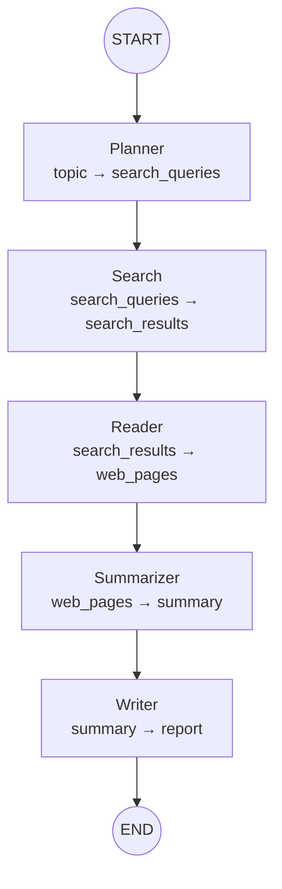

# 架构设计

## 概述

Research Agent 是一个基于 **LangGraph** 的 AI 研究助手。用户输入一个研究主题，Agent 自动完成搜索、阅读、分析、报告生成的全流程。

整体架构遵循 **分层解耦** 原则：

```
┌──────────────────────────────────────────┐
│              Command Line                 │
│         (__main__.py / scripts/)          │
├──────────────────────────────────────────┤
│              Workflow Layer               │
│          (graph/ + state/)                │
├──────────────────────────────────────────┤
│   Nodes         │   Prompts               │
│   (nodes/)      │   (prompts/)            │
├──────────────────────────────────────────┤
│   Tools Layer                             │
│   (tools/ - search / web_reader)          │
├──────────────────────────────────────────┤
│   LLM Layer                               │
│   (llm/ - 抽象基类 + OpenAI Compatible)   │
└──────────────────────────────────────────┘
```

## 模块职责

### LLM 层 (`llm/`)

**职责**：提供统一的 LLM 调用接口，屏蔽不同模型提供商的差异。

**关键设计**：

- **抽象基类** `BaseLLMClient` 定义 `invoke` / `ainvoke` 契约
- **工厂函数** `get_llm()` 根据配置返回对应实现，调用方不感知具体类
- **错误映射**：将 OpenAI SDK 的 `APIStatusError` 等异常映射为业务异常（`LLMAuthenticationError`、`LLMRateLimitError` 等）
- **当前实现**：`OpenAICompatibleClient`，兼容所有 OpenAI Chat Completions 接口的模型（通义千问、GPT、DeepSeek 等）

**扩展方式**：

```python
class GPTClient(BaseLLMClient):
    def invoke(self, message: str, **kwargs) -> LLMResponse: ...
    async def ainvoke(self, message: str, **kwargs) -> LLMResponse: ...

register_provider("gpt", GPTClient)
```

### 工具层 (`tools/`)

**职责**：提供搜索和网页读取两个基础能力，保持独立可替换。

**关键设计**：

- **搜索**：`BaseSearchClient` 抽象基类 + Registry 模式。当前使用 `ddgs` 库（DuckDuckGo），通过 `register_search_engine()` 注册新引擎
- **网页读取**：`BaseWebReader` 抽象基类。`HtmlWebReader` 基于 httpx + BeautifulSoup，自动降级（403 → 备用 UA + verify=False）
- **数据模型**：`SearchResult` 和 `WebPage` dataclass，作为层间数据契约

**扩展方式**：

```python
register_search_engine("tavily", TavilySearchClient)
register_web_reader("jina", JinaWebReader)
```

### Prompt 层 (`prompts/`)

**职责**：统一管理所有 LLM Prompt，与代码分离。

**关键设计**：

- Prompt 以 `.txt` 文件存储，修改 Prompt 不需要改 Python 代码
- `load_prompt(name, **kwargs)` 基于 Python `str.format()` 做模板渲染
- 变量用 `{topic}`、`{pages_text}` 等占位符

### 节点层 (`nodes/`)

**职责**：实现 Workflow 中每个节点的具体逻辑。

**设计原则**：

- **单一职责**：每个节点只做一件事（planner 只生成关键词、search 只搜索、reader 只抓取...）
- **纯函数式**：接收 `ResearchState`，返回 `dict` 增量更新，无副作用
- **错误隔离**：单个节点失败不影响整个 Graph 运行

### Workflow 层 (`graph/` + `state/`)

**职责**：用 LangGraph 编排节点执行顺序，维护全局状态。

**关键设计**：

- `StateGraph(ResearchState)` 编译为可调用对象
- 节点间**只通过 State 传递数据**，无直接函数调用
- `ResearchState` 使用 `TypedDict` 定义，字段顺序对应数据流方向

## Workflow 流程



## 数据流

```
topic (str)
  ↓ Planner (LLM)
search_queries (list[str])
  ↓ Search (DuckDuckGo)
search_results (list[SearchResult])
  ↓ Reader (httpx + BeautifulSoup)
web_pages (list[WebPage])
  ↓ Summarizer (LLM)
summary (str)
  ↓ Writer (LLM)
report (str)
```

## 扩展指南

### 添加新搜索提供商

1. 在 `tools/search.py` 继承 `BaseSearchClient`
2. 调用 `register_search_engine("engine_name", YourClient)`
3. 调用方传 `get_search_client("engine_name")` 即可

### 添加新 Workflow 节点

1. 在 `state/__init__.py` 的 `ResearchState` 中新增字段
2. 在 `nodes/` 下创建节点函数
3. 在 `graph/__init__.py` 中 `add_node()` + `add_edge()`

### 切换 LLM 模型

修改 `.env`：
```env
LLM_BASE_URL=https://api.openai.com/v1
LLM_MODEL=gpt-4o-mini
DASHSCOPE_API_KEY=sk-xxxxx
```

## 技术选型

| 组件 | 选择 | 理由 |
|---|---|---|
| Workflow 编排 | LangGraph | DAG 驱动、状态管理、可视化、条件边、Human-in-the-Loop |
| LLM 接口 | OpenAI Compatible | 通义千问 / GPT / DeepSeek 统一协议 |
| 网页抓取 | httpx + BeautifulSoup | 零依赖第三方服务、去干扰能力强 |
| 搜索 | ddgs (DuckDuckGo) | 免 API Key，零配置可用 |
| 配置 | pydantic-settings | 类型校验、自动 .env 加载 |
