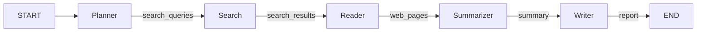

# Research Agent

基于 LangGraph 和通义千问 API 的 AI 研究助手。

## 功能

- **自动研究** — 输入主题，Agent 自动完成搜索、阅读、分析、报告全流程
- **多引擎搜索** — 默认 DuckDuckGo（免 API Key），可扩展 Tavily、Google 等
- **结构化报告** — 输出 Markdown 格式研究报告，含概述、主体分析、总结与参考来源
- **模块化架构** — 基于 LangGraph 的节点化工作流，便于扩展

## 快速开始

```bash
# 1. 克隆项目
git clone https://github.com/your/repo.git
cd research-agent

# 2. 创建虚拟环境
python -m venv .venv
source .venv/bin/activate       # Linux/Mac
.venv\Scripts\activate          # Windows

# 3. 安装依赖
pip install -r requirements.txt

# 4. 配置环境变量
cp .env.example .env
# 编辑 .env，填入 DASHSCOPE_API_KEY

# 5. 运行
python -m research_agent "你的研究主题"
```

### Docker

```bash
docker build -t research-agent .
docker run --rm -e DASHSCOPE_API_KEY=your-key research-agent "你的研究主题"
```

## 项目结构

```
research-agent/
├── src/
│   └── research_agent/
│       ├── __init__.py
│       ├── __main__.py          # CLI 入口
│       ├── config.py            # 环境变量配置
│       ├── state/               # LangGraph 状态定义
│       ├── nodes/               # Graph 节点（planner / search / reader / summarizer / writer）
│       ├── graph/               # StateGraph 组装
│       ├── tools/               # 工具层（search / web_reader）
│       ├── prompts/             # Prompt 模板（.txt 文件）
│       └── llm/                 # LLM 客户端抽象（OpenAI Compatible）
└── tests/                       # 单元测试
```

## Workflow



### 各节点职责

| Node | 输入 | 输出 | 职责 |
|---|---|---|---|
| **Planner** | topic | search_queries | 调用 LLM 生成 3~5 个搜索关键词 |
| **Search** | search_queries | search_results | 搜索引擎批量查询，URL 去重 |
| **Reader** | search_results | web_pages | 并发抓取网页，去除广告/导航 |
| **Summarizer** | web_pages | summary | LLM 综合多来源生成摘要 |
| **Writer** | summary | report | LLM 输出 Markdown 报告 |

## API 使用

```python
from research_agent.graph import graph

result = graph.invoke({"topic": "Python 异步编程"})
print(result["report"])
```

## 配置

| 环境变量 | 默认值 | 说明 |
|---|---|---|
| `DASHSCOPE_API_KEY` | — | 通义千问 API Key |
| `LLM_BASE_URL` | `https://dashscope.aliyuncs.com/compatible-mode/v1` | API 地址 |
| `LLM_MODEL` | `qwen-plus` | 模型名称 |
| `SEARCH_ENGINE` | `duckduckgo` | 搜索引擎 |

### 切换模型

只需修改 `.env` 文件即可切换到 GPT、DeepSeek 等：

```env
LLM_BASE_URL=https://api.openai.com/v1
LLM_MODEL=gpt-4o-mini
DASHSCOPE_API_KEY=sk-xxxxx   # 改为你的 OpenAI API Key
```

## 开发

```bash
# 安装测试依赖
pip install pytest

# 运行测试
pytest tests/ -v

# 运行端到端测试
python scripts/test_workflow.py "你的主题"
```

## Roadmap

### v0.1（当前）— MVP

- [x] 基础 LLM 客户端（OpenAI Compatible）
- [x] DuckDuckGo 搜索
- [x] HTML 网页抓取与正文提取
- [x] LangGraph Workflow（Planner → Search → Reader → Summarizer → Writer）
- [x] 单元测试

### v0.2 — 稳定性与质量提升

- [ ] Tavily / 多搜索引擎支持
- [ ] 搜索结果质量评估
- [ ] 读取失败自动重试与降级
- [ ] 结构化日志
- [ ] 异步化节点加速

### v0.3 — 深度研究能力

- [ ] Reflection：对搜索结果进行反思与补充搜索
- [ ] 多轮搜索（根据已读内容自动生成追问）
- [ ] 结果过滤与评分

### v1.0 — 生产可用

- [ ] 多 Agent 协作（角分工）
- [ ] Memory / 持久化
- [ ] Web 界面 / API 服务
- [ ] Human-in-the-Loop 审批
- [ ] 多种报告格式（PDF、HTML）
