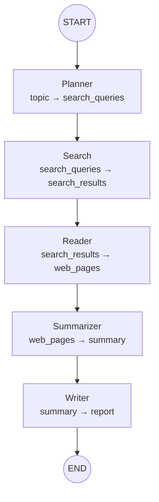

<div align="center">

# Research Agent 🧠📄

**AI-powered research assistant** — Input a topic, get a structured Markdown report.

Automates the full research pipeline: **search → read → summarize → write**.

[](https://www.python.org/)
[](https://langchain-ai.github.io/langgraph/)
[](LICENSE)
[](https://github.com/Zyuting/ai-research-agent/pulls)

</div>

---

## ✨ Features

- **End-to-end automation** — One topic in, full report out. No manual searching or reading.
- **LLM-powered planning** — Generates optimal search queries from your topic.
- **Multi-engine search** — DuckDuckGo built-in (zero config), pluggable architecture for Tavily, Google, etc.
- **Intelligent web reading** — Extracts main content, strips ads/navigation. Auto-fallback on 403.
- **Structured reports** — Markdown output with overview, analysis, conclusion, and references.
- **Model-agnostic** — Switch between Qwen, GPT, DeepSeek, or any OpenAI-compatible API via `.env`.
- **Modular & extensible** — Abstract base classes + Registry pattern. Add new search engines, readers, or LLM providers without touching core logic.

---

## 🏗️ System Architecture

The project follows a **layered, decoupled architecture**:

```
┌──────────────────────────────────────────┐
│              CLI / Scripts                │
│         (__main__.py / scripts/)          │
├──────────────────────────────────────────┤
│              Workflow Layer               │
│          (LangGraph StateGraph)           │
├──────────────────────────────────────────┤
│   Nodes         │   Prompts               │
│   (5 nodes)     │   (.txt files)          │
├──────────────────────────────────────────┤
│   Tools Layer                             │
│   (Search + Web Reader)                  │
├──────────────────────────────────────────┤
│   LLM Layer                               │
│   (BaseLLMClient + OpenAI Compatible)     │
└──────────────────────────────────────────┘
```

## 🔄 Workflow



| Step | Node | Function |
|------|------|----------|
| 1 | **Planner** | LLM generates 3–5 search keywords from your topic |
| 2 | **Search** | Queries DuckDuckGo (or configured engine), deduplicates URLs |
| 3 | **Reader** | Concurrently fetches pages, strips ads/navigation, extracts main content |
| 4 | **Summarizer** | LLM synthesizes a cross-source summary |
| 5 | **Writer** | LLM formats a Markdown report with sections and citations |

---

## 📁 Project Structure

```
research-agent/
├── src/
│   └── research_agent/
│       ├── __main__.py          # CLI entry point
│       ├── config.py            # pydantic-settings config (.env)
│       ├── state/               # ResearchState (TypedDict)
│       ├── nodes/               # 5 workflow nodes
│       │   ├── planner.py       #   topic → search_queries
│       │   ├── search_node.py   #   search_queries → search_results
│       │   ├── reader.py        #   search_results → web_pages
│       │   ├── summarizer.py    #   web_pages → summary
│       │   └── writer.py        #   summary → report
│       ├── graph/               # StateGraph assembly
│       ├── tools/               # Search & Web Reader
│       │   ├── search.py        #   BaseSearchClient + DuckDuckGo
│       │   ├── web_reader.py    #   BaseWebReader + HtmlWebReader
│       │   └── models.py        #   SearchResult, WebPage
│       ├── prompts/             # LLM prompt templates (.txt)
│       └── llm/                 # LLM abstraction layer
│           ├── base.py          #   BaseLLMClient + LLMResponse
│           ├── _openai.py       #   OpenAI-compatible implementation
│           ├── factory.py       #   get_llm() factory
│           └── errors.py        #   LLMError hierarchy
├── tests/                       # pytest test suite
├── scripts/                     # Development & testing scripts
├── requirements.txt
├── pyproject.toml
├── ARCHITECTURE.md              # In-depth architecture docs
└── README.md
```

---

## 🚀 Quick Start

### Prerequisites

- Python 3.11+
- A [DashScope](https://help.aliyun.com/dashscope) API key (or any OpenAI-compatible API key)

### Installation

```bash
# Clone & enter
git clone https://github.com/Zyuting/ai-research-agent.git
cd ai-research-agent

# Virtual environment
python -m venv .venv
source .venv/bin/activate       # Linux / macOS
# .venv\Scripts\activate        # Windows

# Install dependencies
pip install -r requirements.txt

# Configure
cp .env.example .env
# Edit .env: set DASHSCOPE_API_KEY=your-key
```

### Run

```bash
python -m research_agent "Transformer architecture evolution"
```

**Example output:**
> An AI-generated report covering Transformer model architecture, attention mechanisms, and key evolutionary milestones — structured with sections, citations, and references.

### Python API

```python
from research_agent.graph import graph

result = graph.invoke({"topic": "Rust in system programming"})
print(result["report"])  # Markdown string
```

---

## ⚙️ Configuration

All settings via `.env` file:

| Variable | Default | Description |
|---|---|---|
| `DASHSCOPE_API_KEY` | — | Your LLM API key |
| `LLM_BASE_URL` | `https://dashscope.aliyuncs.com/compatible-mode/v1` | API endpoint |
| `LLM_MODEL` | `qwen-plus` | Model name |
| `SEARCH_ENGINE` | `duckduckgo` | Search backend |

### Switch to GPT / DeepSeek

```env
LLM_BASE_URL=https://api.openai.com/v1
LLM_MODEL=gpt-4o-mini
DASHSCOPE_API_KEY=sk-xxxxx
```

---

## 🧪 Testing

```bash
pip install pytest
pytest tests/ -v
```

```
============================= test session starts =============================
tests/test_config.py    ·· PASSED                                            [ 7%]
tests/test_llm.py       ·· PASSED                                            [15%]
tests/test_prompts.py   ···· PASSED                                          [46%]
tests/test_tools.py     ···· PASSED                                          [84%]
tests/test_workflow.py  ·· PASSED                                            [100%]
========================= 13 passed in 39.55s ================================
```

---

## 🗺️ Roadmap

### v1.0 ✅ Current — MVP

- [x] LLM abstraction layer (OpenAI-compatible)
- [x] DuckDuckGo search integration
- [x] HTML web reader with noise removal
- [x] LangGraph workflow (Planner → Search → Reader → Summarizer → Writer)
- [x] Unit test suite (13 tests)

### v1.1 🔜 Next

- [ ] Tavily / multi-engine search
- [ ] Search quality scoring
- [ ] Retry & fallback for failed reads
- [ ] Structured logging
- [ ] Async node execution for speed

### v1.2 — Deeper Research

- [ ] Reflection: self-critique and re-search
- [ ] Iterative query refinement
- [ ] Source relevance filtering

### v2.0 — Production Ready

- [ ] Multi-agent collaboration
- [ ] Research memory / persistence
- [ ] Web UI / REST API
- [ ] Human-in-the-loop review
- [ ] PDF / HTML report export

---

## 🧩 Extensibility

| Want to... | Do this |
|---|---|
| Add a search engine | `register_search_engine("tavily", TavilyClient)` |
| Add a web reader | `register_web_reader("jina", JinaReader)` |
| Change the LLM | Edit `.env` → `LLM_BASE_URL` + `LLM_MODEL` |
| Add a workflow node | 1) Add field in `State` 2) Create node function 3) `add_node()` + `add_edge()` |

See [ARCHITECTURE.md](ARCHITECTURE.md) for detailed design docs.

---

## 🤝 Contributing

PRs are welcome! For major changes, please open an issue first to discuss.

1. Fork the repository
2. Create your feature branch (`git checkout -b feat/amazing`)
3. Run tests (`pytest tests/ -v`)
4. Commit (`git commit -m 'feat: add amazing feature'`)
5. Push (`git push origin feat/amazing`)
6. Open a Pull Request

## 📄 License

[MIT](LICENSE) © 2026 Yueting Zhang
